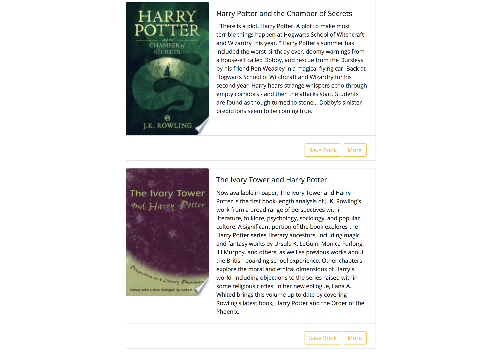

## Google Books Search

Google Books Search is a MERN stack app built with the Google Books API.

### Technologies

- React
- Express
- Node
- MongoDB
- TypeScript
- Google Books API

### About

This application runs on an Express/Node server. Models, controllers, database and API routes are held on the server side while front-end API routes, React pages, logic and database queries are structured on the client side. 

TypeScript helps to strucute and maintain state data across the application's lifecycle. 

You can demo the application here: 
https://react-google-books-kathryn.herokuapp.com/
